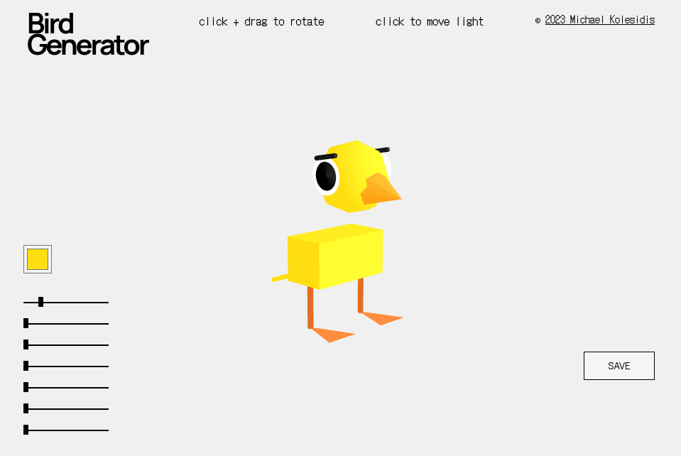
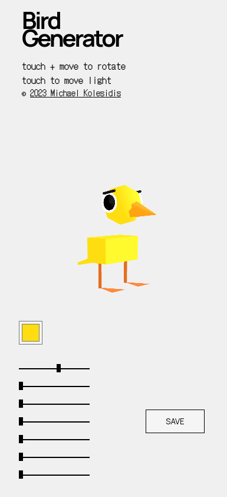
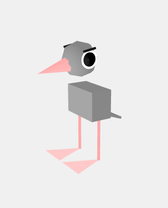
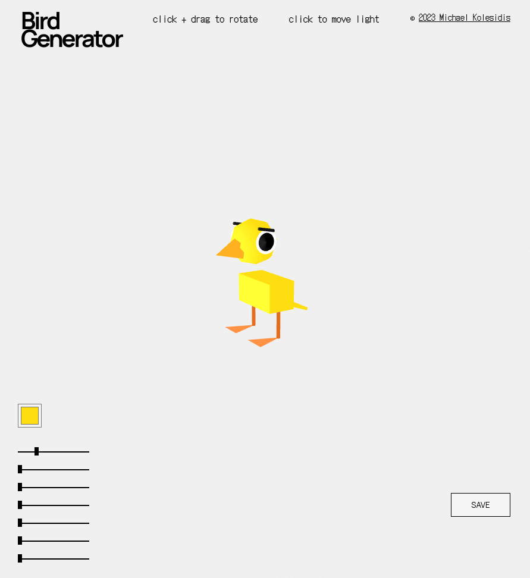
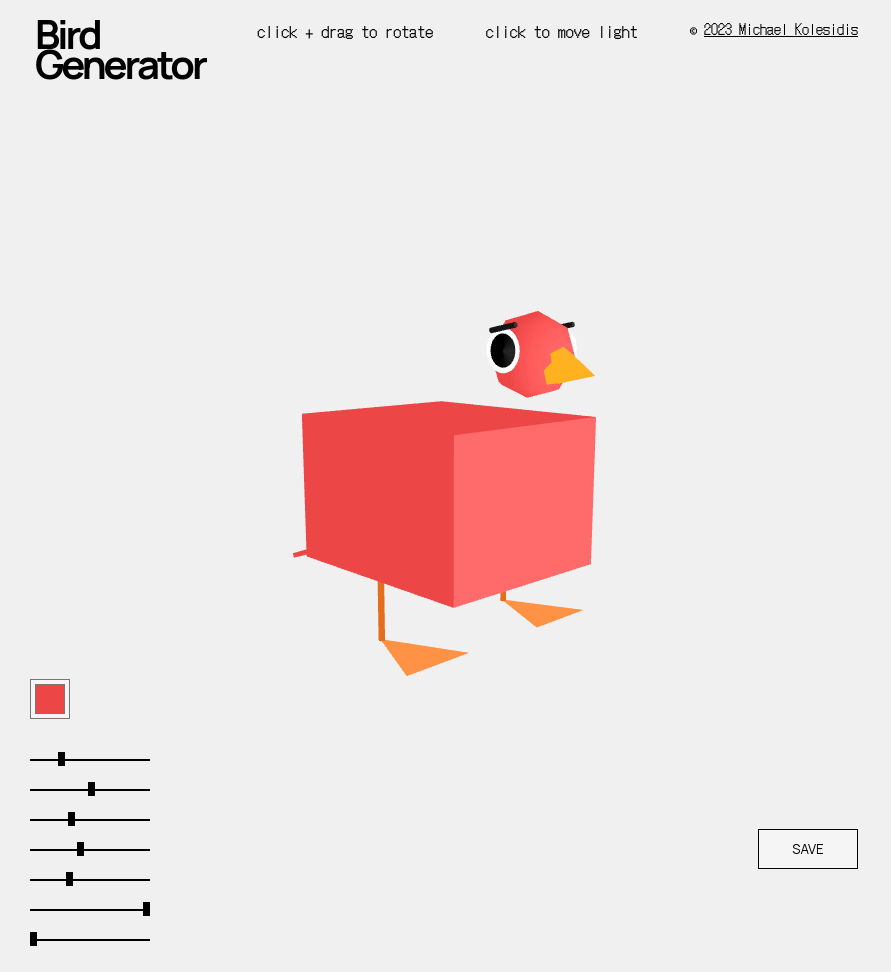
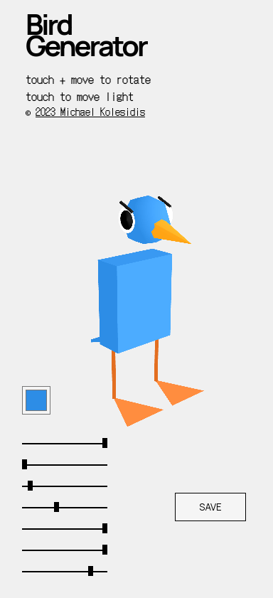
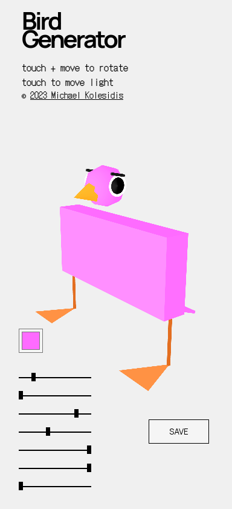

# Bird Generator™

A Bird Generator™ made with p5.js.

## Technologies Used

&nbsp;&nbsp;&nbsp;&nbsp;&nbsp;&nbsp;

&nbsp;&nbsp;&nbsp;&nbsp;&nbsp;&nbsp;

&nbsp;&nbsp;&nbsp;&nbsp;&nbsp;&nbsp;

## Information

**Bird, lights, go!**

You can use the color pickers and the sliders to generate your bird of choice.
You can edit:

- Bird's color
- Beak's and legs' color
- Body height
- Body width
- Body length
- Beak length
- Leg height
- Foot size
- Eyebrow angle

Lastly, click (or tap) around to place the source of the directional light.

When you are happy with the result, simply click the _Save_ button and download your bird!

## Screenshots

### Desktop

### Mobile

## Acknowledgments

- Thanks to all p5.js contributors and, especially, to [_inaridarkfox4231_](https://github.com/inaridarkfox4231) for their contributions in impoving orbitControl() in version 1.7.0.

- Sliders' CSS were written by [_amygoodchild_](https://github.com/amygoodchild) and were edited by me. They are available at p5js.org.

## License

Copyright (c) 2022-2024 Michael Kolesidis 
Licensed under the [GNU Affero General Public License v3.0](https://www.gnu.org/licenses/agpl-3.0.html).

🐦🦜🦃🐓🐤🐧🕊️🦅🦆🦢🦉🦤🦩🦚
